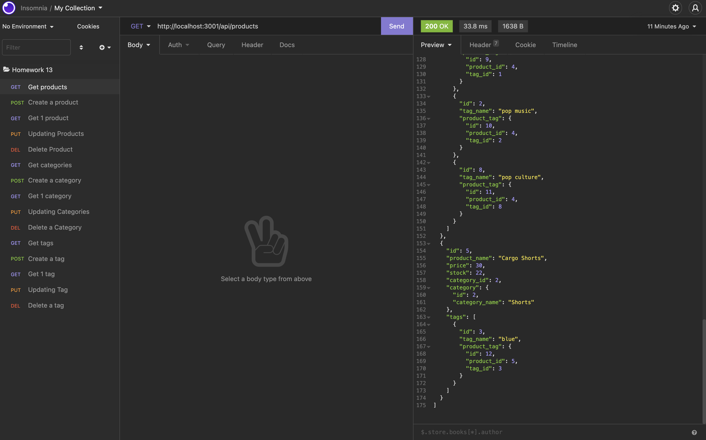

  

  # E-Commerce Back End
  
  ## Description
  This is a developed back end for an online retail store to help them use the latest technology. We use MySql to keep the information. 
  
  ## Video Link
  https://drive.google.com/drive/folders/1xcvxdur2wS8mSKBWcQ4gHmvkjHFZCXd0?usp=sharing
  
  ## Screenshot of application
   
  
  ## Table of Contents
  - [Installation](#installation)
  - [Usage](#usage)
  - [Contributing](#contributing)
  - [License](#license)
  - [Badges](#badges)
  - [Features](#features)
  - [Tests](#test)
  - [Questions](#questions)
 
  ## Installation
  `npm -i inquirer`,  to install inquirer. 
   `npm i dotenv`, to install dotenv
  `mysql -u root -p`, to set up mysql
  `source schema.sql`, to set schema
  `exit`, to exit mysql database
  `npm run seed`, to input base data
  `node server.js`, to run the application.
  
  ## Contributing
  Feel free to add or change any code.

  
  ## License
  Community
  

  ## Features
  Inquirer, Sequalize, MySQL: database, Express.js, dotenv.
  
  ## Tests
  N/A
 
  
  ## Questions
  If you have any questions feel free to contact me via email kevinc.php@gmail.com, Github kevin-cortina.
  
